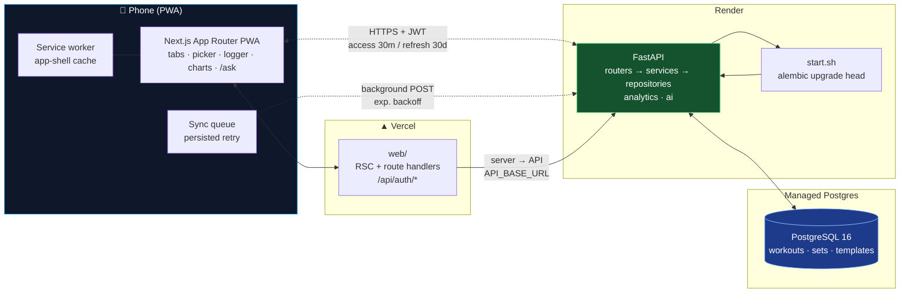
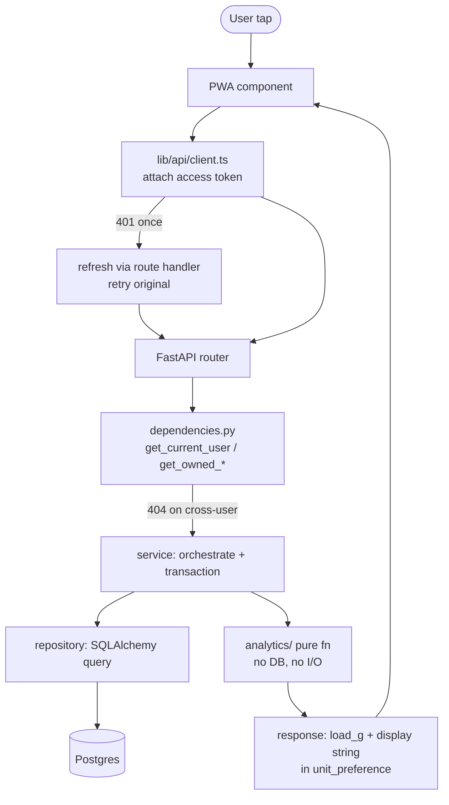
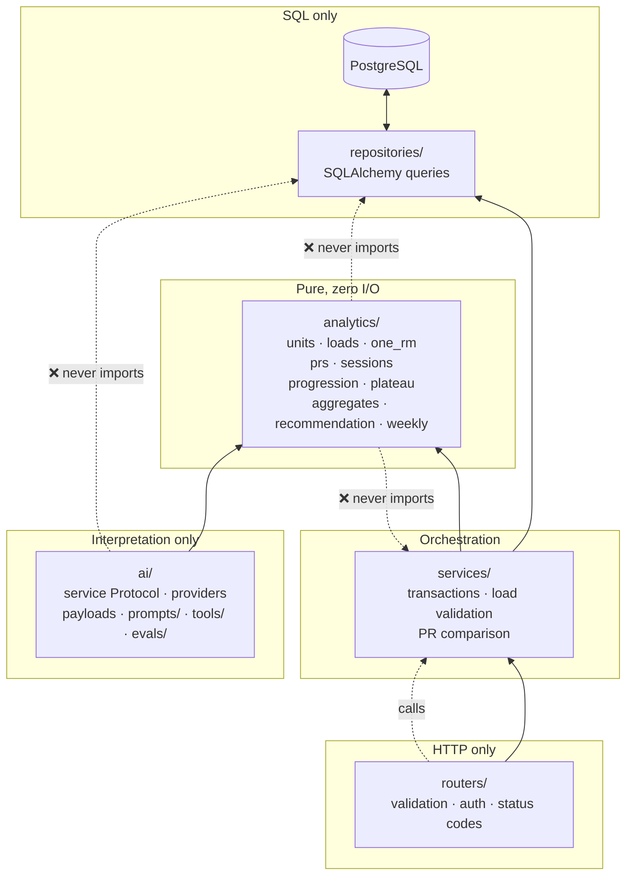
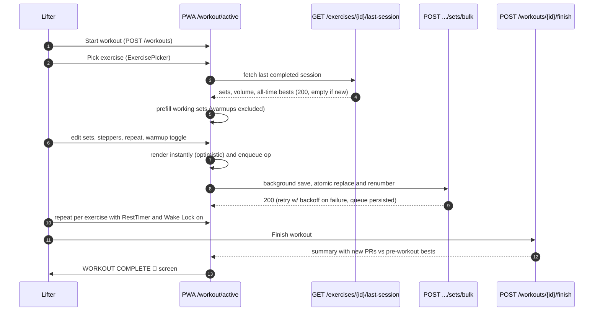
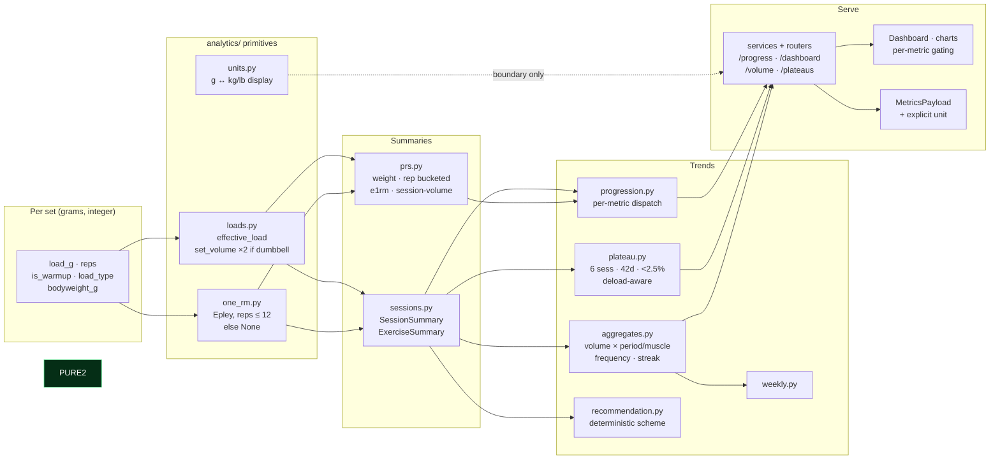
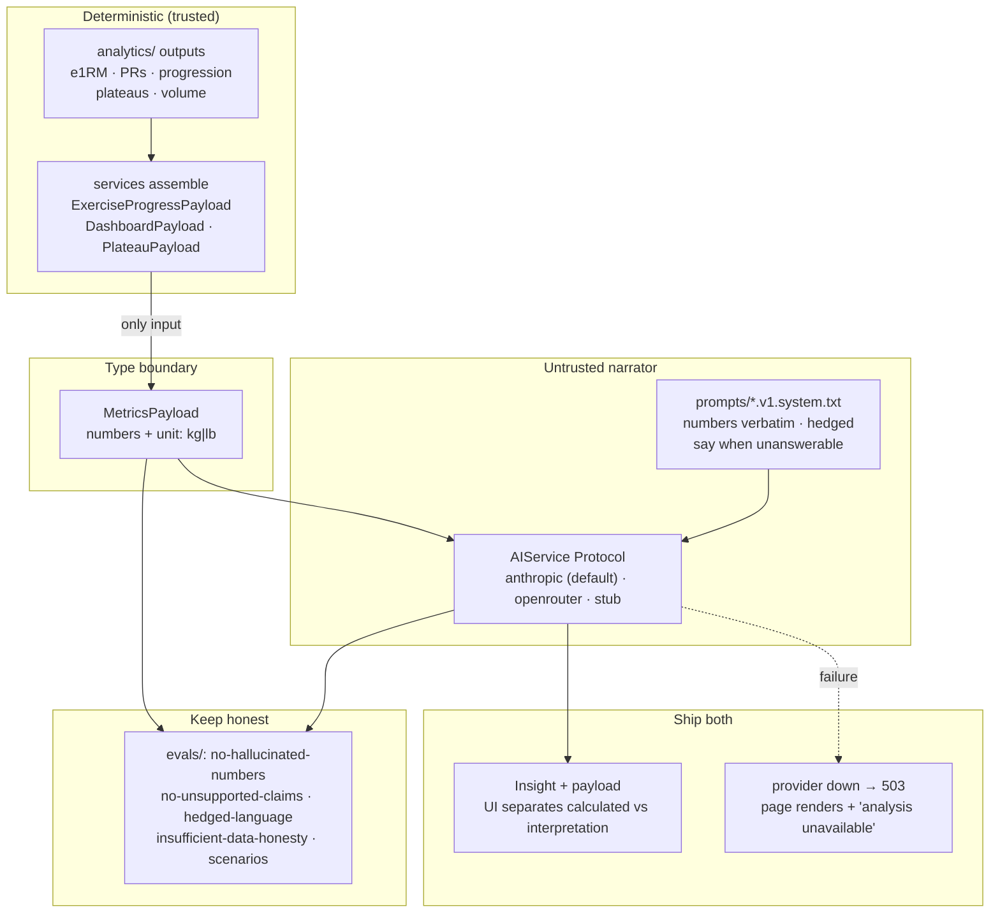
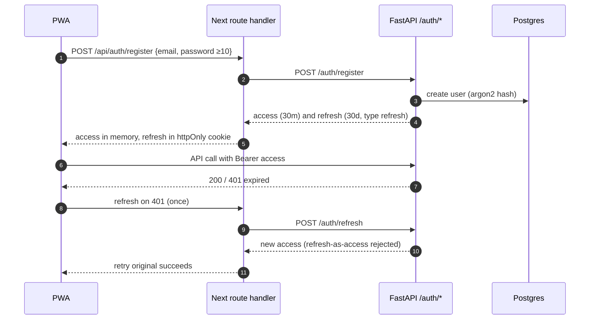
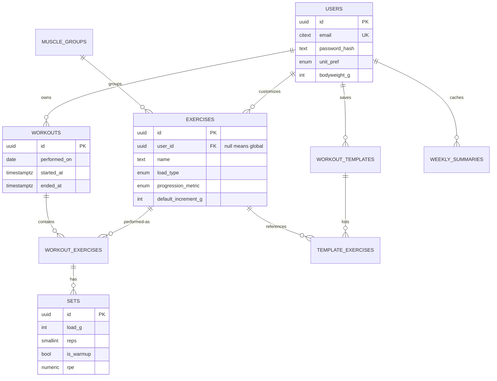

# LiftLog AI 🏋️

A personal strength-progression system. Track every gym workout as structured data,
compute progression **deterministically**, and layer AI on top as an **interpretation
engine that never does arithmetic**.

> **Status:** All 6 phases of [`liftlog.md`](./liftlog.md) are implemented, tested, and
> deployed. The PWA installs on iOS/Android and the full logging loop has been verified
> on a real phone in the gym.
>
> Demo: _record a short GIF of the logging loop on a phone and replace this line with
> ``._


---

## Table of contents

- [Features](#features)
- [System architecture](#system-architecture)
- [Backend layering](#backend-layering)
- [Core workout loop](#core-workout-loop)
- [Analytics pipeline](#analytics-pipeline)
- [AI layer: grounded interpretation](#ai-layer-grounded-interpretation)
- [Auth, sync & PWA](#auth-sync--pwa)
- [Data model](#data-model)
- [Tech stack](#tech-stack)
- [Non-negotiable invariants](#non-negotiable-invariants)
- [Why analytics before AI](#why-analytics-before-ai)
- [Grounding and evals](#grounding-and-evals)
- [API reference](#api-reference)
- [Project structure](#project-structure)
- [Local development](#local-development)
- [Testing](#testing)
- [Production deployment](#production-deployment)
- [PWA verification](#pwa-verification)
- [What was deliberately left out](#what-was-deliberately-left-out)

---

## Features

**Core loop (the product)**

- Mobile-first PWA: bottom tabs (Home / Workout / Exercises / History), 48px+ tap
  targets, dark mode by default, safe-area-aware layout.
- Exercise library: search-as-you-type (200ms debounce), muscle-group chips, recently
  performed first, custom-exercise sheet with plain-language load-type help.
- **Last-session panel**: previous session (`load × reps`), relative + absolute date,
  PRs and estimated 1RM, skeleton loader, first-timer empty state. Prefills the next
  workout's working sets (warmups excluded) in one tap.
- Active workout screen: `SetRow` with number pads + `default_increment_g` steppers,
  warmup toggle, repeat-previous-set, optimistic UI with persisted retry queue
  (exponential backoff, no lost sets on refresh / network kill), `RestTimer` with
  sound/haptic cue, Wake Lock so the screen never sleeps mid-set.
- Finish screen: exercise count, working sets, total volume, duration, and **new PRs
  detected against pre-workout bests** (`WORKOUT COMPLETE 🎉` summary).
- Voice logging: push-to-talk mic on the active-workout screen
  ("bench press sixty kilos three sets of eight", "same again", "warmup bench 40 ten").
  A deterministic parser (`web/lib/voice/`, offline, no LLM) turns the transcript into
  sets; a confirm sheet shows what was heard and nothing saves until you confirm.
  Confirmed sets flow through the same offline-safe sync queue as typed sets.
- Templates: save any workout as a template, start a fully prefilled workout from a
  template (Push / Pull / Legs is yours to build).
- History: cursor-paginated workout list; export of full history as JSON + CSV
  (data portability is a feature).

**Deterministic insight**

- Per-exercise progression dispatched on its own `progression_metric`
  (`e1rm` / `top_weight` / `volume` / `reps_at_load`), with `insufficient_data`
  instead of a percentage off two points.
- Conservative plateau detection (≥6 sessions, ≥42 days, <2.5% gain, deload-aware)
  that states facts ("no new best in 7 weeks"), never diagnoses.
- Dashboard: today's suggestion card, top-3 improving exercises, recent PRs, weekly
  volume vs. prior week, 30-day consistency + streak — one `/analytics/dashboard` call.
- Charts (Recharts, 380px-legible, touch tooltips, ≤6 x-axis ticks): e1RM / top weight /
  session volume over time (gated by `progression_metric`), muscle-group distribution,
  weekly frequency.

**AI interpretation (never computation)**

- `POST /ai/analyze-progress`, `POST /ai/chat` (5-tool-round cap, inspectable trace),
  `POST /ai/workout-recommendation` (deterministic scheme + LLM explanation),
  `GET /ai/weekly-summary` (cached per user per ISO week).
- `/ask` chat page with a collapsible **"data used"** section per answer; starter
  questions included. No vector search — structured SQL is the right retrieval for
  structured data.
- Mechanical evals (`app/ai/evals/`): hallucinated numbers, unsupported claims, hedged
  language, insufficient-data honesty, improving/flat/declining scenarios.

---

## System architecture



**Request path.** Browser calls go to `NEXT_PUBLIC_API_BASE_URL`; Next.js route
handlers (`web/app/api/auth/*`, proxy) use `API_BASE_URL` so cookies stay httpOnly.
The API serves OpenAPI at `/docs`; `web/lib/api/schema.d.ts` is generated from it
via `npm run gen:api`, and CI fails the PR if the regenerated file drifts.



---

## Backend layering

Layering is enforced structurally, not by convention.



```
api/app/
  main.py            app factory, CORS, RequestID → SecurityHeaders → RateLimit,
                     exception handlers, router includes, GET /health
  core/              config.py (env-only secrets), security.py (argon2, JWT),
                     dependencies.py (get_current_user, get_owned_*, 404≠403),
                     errors.py (AppError → {"error":{"code","message"}}),
                     middleware.py (headers, request id, JSON logs), rate_limit.py
  db/                session.py (engine, SessionLocal, get_db), base.py,
                     models/ (users, muscle_groups, exercises, workouts,
                              workout_exercises, sets, workout_templates,
                              weekly_summaries)
  schemas/           Pydantic v2, extra="forbid" — unknown fields → 422
  repositories/      SQL via SQLAlchemy (incl. analytics/export/weekly/template)
  services/          orchestration + transactions + load_type validation
  analytics/         PURE functions — typed in, typed out, no DB, no I/O
  ai/                service Protocol, providers/ (anthropic, openrouter, stub),
                     payloads.py (MetricsPayload), prompts/*.v1.system.txt,
                     tools/ (9 scoped tools + fuzzy name resolve), evals/
  routers/           health, auth, me, exercises, workouts, templates,
                     analytics, export, ai
```

---

## Core workout loop

The 4-tap path (cold open → first set logged) and the offline-safe save:



**Offline contract.** The pending queue survives refresh; a network kill mid-workout
loses zero sets — they sync when connectivity returns, with no duplicates and no
stuck queue (covered by `syncQueue.test.ts` + flaky-network tests).

---

## Analytics pipeline

All numbers flow one way: raw sets → typed primitives → session/exercise summaries →
trends → API payloads → (charts | AI payload). The LLM sits *after* the pipeline,
never inside it.



**Load-type math** (`loads.py`): `dumbbell_per_hand` counts per-hand load for strength
but doubles for volume; `bodyweight` uses `bodyweight_g`; `bodyweight_added` adds it;
`assisted` adds a negative assistance value. Missing bodyweight where required raises
`MissingBodyweightError` and the caller degrades gracefully.

---

## AI layer: grounded interpretation



The **tool-calling agent** (`POST /ai/chat`, used by `/ask`) loops at most 5 rounds
over 9 user-scoped tools — history, last workout, PRs, progress, volume, recent
workouts, PRs-in-period, plateaus, muscle distribution. Exercise names resolve
**fuzzily but deterministically in app code** ("bench" → id, disambiguation list when
uncertain); the model never sees raw rows and never invents ids. Every answer ships
with its tool trace under "data used".

Recommendations split the work on purpose: `analytics/recommendation.py` computes the
set/rep scheme from `default_increment_g` + recent performance (reproducible,
testable); the LLM only writes the hedged explanation around it.

---

## Auth, sync & PWA



Ownership: `get_owned_workout` / `get_owned_workout_exercise` / `get_owned_set` /
`get_visible_exercise` (globals + own customs) return **404 for missing *or*
foreign records** — existence is never confirmed. A CI test enumerates the OpenAPI
schema and asserts no non-auth route skips authentication.

PWA shell: `app/manifest.ts` (name, icons 192/512/maskable, standalone,
`theme_color #0a0a0a`), `public/sw.js` (app-shell cache, network-first API /
cache-first static), `viewport-fit=cover` + `env(safe-area-inset-bottom)`,
`middleware`/proxy auth gate, resume-active-workout banner. Installable from the
production URL on iOS + Android.

---

## Data model



| `load_type` | Meaning | Validation (`load_g`) | Volume |
|---|---|---|---|
| `barbell_total` | total on the bar | `> 0` | `load × reps` |
| `machine_total` | whole-stack / sled | `> 0` | `load × reps` |
| `dumbbell_per_hand` | weight of **one** dumbbell | `> 0` | `load × reps × 2` |
| `bodyweight` | unweighted calisthenics | `== 0` | `bodyweight × reps` |
| `bodyweight_added` | belt / vest on top | `≥ 0` | `(bw + load) × reps` |
| `assisted` | machine assistance (stored **negative**) | `< 0` | `(bw + load) × reps` |

PRs are **computed from `sets`, never stored**: heaviest set, bucketed rep-PR
(loads rounded to `default_increment_g` so 60.0 ≈ 60.4 kg), best valid e1RM, best
single-session volume. Warmups excluded everywhere; ties → earliest occurrence.

---

## Tech stack

| Layer | Choice |
|---|---|
| Frontend | Next.js App Router + TypeScript (strict) + Tailwind, mobile-first PWA |
| Backend | FastAPI + SQLAlchemy 2.0 (`Mapped[]`) + Pydantic v2 + Alembic |
| Database | PostgreSQL 16 |
| Type sync | `openapi-typescript` → `web/lib/api/schema.d.ts` (CI drift check) |
| Auth | JWT access (30m) + refresh (30d, `type` claim), argon2 hashing |
| Charts | Recharts, phone-legible |
| AI | Provider abstraction (`anthropic` default, `openrouter`, `stub`); key server-side only |
| Deploy | Vercel (web) + Render (api, Docker) + managed Postgres |
| CI | Backend / Frontend / Uptime workflows under `.github/workflows/` |

---

## Non-negotiable invariants

1. **All loads are integer grams.** 62.5 kg is `62500`. Display-unit conversion happens
   only at the API boundary (`units.py` + response display strings).
2. **Volume math is `load_type`-aware.** A dumbbell press at 22500 g × 10 is 450,000 g.
3. **`is_warmup` filters every analytic.** PRs, volumes, trends.
4. **e1RM has a validity window.** Epley, only for `1 ≤ reps ≤ 12`; otherwise `None`.
5. **Each exercise declares its `progression_metric`.** Compounds → e1RM; isolation →
   volume / reps-at-load. Charts obey it (no meaningless 1RM curve for lateral raises).
6. **The LLM never computes.** It receives a typed `MetricsPayload`; every number it
   mentions must already exist in that payload.
7. **Ownership violations return 404, not 403.**

---

## Why analytics before AI

Fitness apps that let an LLM do arithmetic hallucinate PRs. LiftLog inverts the
dependency: the deterministic engine (`app/analytics/`, pure functions, ≥95% covered)
computes every number first, and the model receives them as a typed payload with
explicit units. The system prompt then states the grounding contract: every numeric
claim verbatim from the payload, honest "I can't tell from your data" when
underivable, hedged language only, computed facts visually separated from
interpretation. AI endpoints are rate-limited and every screen renders its
deterministic content with an inline "analysis unavailable" note when the provider
fails — AI is never a hard dependency of a page.

## Grounding and evals

`app/ai/evals/` keeps the model honest with mechanical checks instead of vibes:

- `test_no_hallucinated_numbers` — every numeric token in the output must appear in
  the payload (rounding tolerance allowed). Corrupting a payload makes it fail.
- `test_no_unsupported_claims` — no mentioning exercises absent from the payload.
- `test_hedged_language` — no medical/diagnostic phrasing, no guarantees.
- `test_insufficient_data_honesty` — two sessions must not produce a "trend".
- Scenario cases: improving reads as improving, flat never reads as improving,
  declining is never spun as positive.

Evals run against recorded fixtures (deterministic, no network); a separate opt-in
flag hits the live provider. Token usage is logged per request (`liftlog.ai` →
`llm_usage` events with provider, model, operation, input/output tokens), so AI spend
is visible by aggregating the logs.

---

## API reference

Interactive docs at `/docs` when the API runs. Load fields always ship as
**`load_g` + a display string** in the caller's `unit_preference`.

| Group | Endpoints |
|---|---|
| Health | `GET /health` (DB `SELECT 1` → `{"status":"ok"}`) |
| Auth | `POST /auth/register` · `POST /auth/login` · `POST /auth/refresh` |
| Me | `GET /me` · `PATCH /me` (`unit_preference`, `bodyweight_g` only) |
| Library | `GET /muscle-groups` · `GET /exercises?q=&muscle_group=` · `POST /exercises` · `GET/PATCH /exercises/{id}` |
| Insight per exercise | `GET /exercises/{id}/last-session` (hottest path, single query, 200-empty if new) · `GET /exercises/{id}/history?limit=&cursor=` · `GET /exercises/{id}/prs` · `GET /exercises/{id}/progress?period=30d\|90d\|1y\|all` |
| Workouts | `POST /workouts` · `GET /workouts?cursor=` · `GET/PATCH/DELETE /workouts/{id}` · `POST /workouts/{id}/finish` (summary + new PRs) |
| Inside a workout | `POST /workouts/{id}/exercises` · `PATCH /workout-exercises/{id}` (reorder) · `DELETE /workout-exercises/{id}` · `POST /workout-exercises/{id}/sets` · `POST /workout-exercises/{id}/sets/bulk` (atomic replace, renumber from 1) · `PATCH/DELETE /sets/{id}` (delete renumbers contiguously) |
| Analytics | `GET /analytics/dashboard` (one payload: recents, top improvers, PRs, weekly Δ, frequency) · `GET /analytics/muscle-groups?period=` · `GET /analytics/volume?period=&granularity=` · `GET /analytics/plateaus` |
| Templates | `GET/POST /templates` · `GET/PATCH/DELETE /templates/{id}` · `POST /templates/from-workout/{id}` · `POST /workouts/from-template/{id}` |
| Export | `GET /export` (JSON + CSV, lossless round-trip) |
| AI | `POST /ai/analyze-progress` (Insight **+** grounding payload) · `POST /ai/chat` · `POST /ai/workout-recommendation` · `GET /ai/weekly-summary` |

All validation errors are `422` naming the field; error bodies are
`{"error": {"code": str, "message": str}}` with a server-side correlation id and no
stack/SQL leak in production. Request bodies use `extra="forbid"`.

---

## Project structure

```
liftlog/
├── api/
│   ├── app/
│   │   ├── main.py            factory, middleware, routers, /health
│   │   ├── core/              config, security, dependencies, errors,
│   │   │                      middleware, rate_limit
│   │   ├── db/                session, base, models/
│   │   ├── schemas/           Pydantic v2 I/O contracts
│   │   ├── repositories/      SQLAlchemy queries
│   │   ├── services/          orchestration + transactions
│   │   ├── analytics/         pure math (see pipeline above)
│   │   ├── ai/                service, providers/, payloads,
│   │   │                      prompts/, tools/, evals/
│   │   └── routers/           health, auth, me, exercises, workouts,
│   │                           templates, analytics, export, ai
│   ├── tests/                 analytics/ + integration + journey +
│   │                           performance + security + ai evals
│   ├── alembic/               migrations (citext, enums, indexes)
│   ├── seeds/                 seed.py (idempotent), exercises.json,
│   │                           demo_data.py (6-month fixture)
│   ├── Dockerfile + start.sh  prod entrypoint (migrate → serve)
│   └── pyproject.toml         ruff + mypy(strict) + pytest + coverage gates
├── web/
│   ├── app/                   (app) tabs: page, workout, exercises,
│   │                           history, analysis, ask + login/register +
│   │                           manifest.ts + api/auth route handlers
│   ├── components/            SetRow, LastSessionPanel, ExercisePicker,
│   │                           ActiveWorkoutScreen, charts, …
│   ├── hooks/                 useActiveWorkout (+persisted queue),
│   │                           useWakeLock, useDebouncedValue, …
│   ├── lib/api/               client.ts (auto-refresh), schema.d.ts
│   │                           (generated — never hand-edit), per-domain modules
│   ├── public/                sw.js, icons (192/512/maskable)
│   ├── e2e/                   Playwright mobile logging loop
│   └── proxy.ts               auth gate → /login
├── docker-compose.yml         Postgres 16 (+healthcheck) + api w/ --reload
├── Makefile                   up · down · test · lint · migrate
└── .github/workflows/         backend-ci · frontend-ci (type-drift + e2e) · uptime
```

---

## Local development

Requirements: Docker, and [uv](https://docs.astral.sh/uv/) for running the API outside
a container.

```bash
cp api/.env.example api/.env   # fill in a real AUTH_SECRET
make up                        # builds and starts Postgres + the API
```

- API at `http://localhost:8000`, interactive docs at `/docs`.
- Postgres on host port `5434` (service name `db:5432` inside compose).

Running the backend without Docker:

```bash
cd api
uv sync
uv run uvicorn app.main:app --reload
```

Other commands:

```bash
make test      # backend suite (231 tests; coverage gates apply)
make lint      # ruff check + ruff format --check + mypy (strict)
make migrate   # alembic upgrade head
```

### Frontend

Requirements: the API running locally (`make up`), and Node 20+.

```bash
cd web
npm install
cp .env.local.example .env.local   # already points at localhost:8000
npm run dev
```

App at `http://localhost:3000`, dark mode by default, installable as a PWA.

```bash
npm run gen:api   # regenerate lib/api/schema.d.ts from the live /openapi.json
npm test           # vitest: SetRow, LastSessionPanel, offline retry queue (14 tests)
npm run e2e        # Playwright: full logging loop, mobile viewport (needs API + seed)
npm run lint       # eslint
npm run build      # production build + typecheck
```

`.github/workflows/frontend-ci.yml` regenerates `schema.d.ts` against a freshly built
backend on every PR touching `web/` or `api/` and fails if the tree is dirty, so a
backend schema change can't silently drift from frontend types.

---

## Testing

- **Backend** (`cd api && uv run pytest`): 231 tests — unit, analytics, integration,
  journey (register → log → finish → history → progress → AI → export), performance
  (dashboard / last-session / history budgets against a 200-workout fixture, index
  usage, N+1 guard), and AI evals. Overall coverage ≥ 80%, `analytics/` ≥ 95%, both
  enforced in CI. Pure analytics tests (102) run without a database; the rest need
  Postgres (`make up` exposes it on `:5434`).
- **Performance budgets** default to 300 ms locally (`PERF_BUDGET_MS` overrides; CI
  uses 1000 ms since shared runners are noisy).
- **Frontend** (`cd web`): `npm test` (vitest), `npm run e2e` (Playwright, seeded
  compose backend), `npx tsc --noEmit`, `npm run lint`, `npm run build`.
- **CI**: backend (lint, typecheck, tests, coverage gates), frontend (type drift, unit
  tests, build, Playwright e2e against a seeded compose backend), plus a scheduled
  uptime ping against production.

Security posture (all covered by tests): OpenAPI-enumerated auth coverage, strict
`/auth/*` + `/ai/*` rate limits (in-house limiter), env-only secrets (grepped out of
the client bundle), explicit-origin CORS (startup rejects `*`), HSTS / no-sniff / CSP /
referrer headers, Pydantic `extra="forbid"` → clean `422`s, structured JSON logs with
request/user/route/duration and correlation ids.

---

## Production deployment

API on Render (Docker), web on Vercel, Postgres with automated backups. The image
entrypoint (`api/start.sh`) runs `alembic upgrade head` before serving, so every
deploy migrates itself; local compose overrides the command with `--reload` for dev.

API environment variables (all secrets live here, never in the repo or bundle):

| Variable | Purpose |
|---|---|
| `DATABASE_URL` | Postgres connection string |
| `AUTH_SECRET` | JWT signing key (long random string) |
| `AI_API_KEY` | Provider key; empty disables AI gracefully (503 → inline "unavailable" notes) |
| `AI_PROVIDER` | `anthropic` (default) or `openrouter` |
| `AI_MODEL` / `AI_BASE_URL` | Model name / compatible-gateway override |
| `CORS_ORIGINS` | Deployed frontend origin only, never `*` (rejected at startup) |
| `ENVIRONMENT` | `production` |
| `PORT` | Set by the platform; defaults to 8000 |

Web environment: `NEXT_PUBLIC_API_BASE_URL` (browser → API) and `API_BASE_URL`
(server route handlers → API), both pointed at the deployed API.

One-off production setup: run migrations (automatic on first deploy via the
entrypoint), then seed the global exercise library once — from `api/` with the
production `DATABASE_URL` in the environment (e.g. a Render shell):

```bash
uv run python -c "import os; from sqlalchemy import create_engine;
from sqlalchemy.orm import sessionmaker; from seeds.seed import run_seed;
e = create_engine(os.environ['DATABASE_URL']); s = sessionmaker(bind=e)();
run_seed(s); s.commit(); print('seeded')"
```

`.github/workflows/uptime.yml` pings `/health` every 10 minutes (generous timeout
for cold starts) and fails loudly through Actions alerts on a non-200.

---

## PWA verification

Verified on a real phone (installed to home screen, gym-tested):

- [x] Installs from production URL on iOS + Android (icons, splash, standalone).
- [x] Login persists across full app restart (httpOnly refresh cookie + memory access).
- [x] Cold open → first set logged in ≤ 4 taps; last-session renders < 400 ms warm.
- [x] Network kill mid-workout loses zero sets; queue drains on reconnect.
- [x] Screen stays awake during active workout (Wake Lock, silent fallback).
- [x] Lighthouse PWA + accessibility > 90 (re-verify after visual changes).
- [ ] Demo GIF recorded and linked at the top of this file.
- [ ] Voice logging gym-tested: mic permission granted, "bench 60 kilos 3 sets of 8"
  parses to the right confirm sheet, "same again" repeats the last set.

Voice notes: speech recognition is the browser's (Web Speech API — Chrome/Edge and
Safari 14.1+; Firefox shows no mic button), needs connectivity and a secure context
(HTTPS in prod, `localhost` in dev), and streams utterances to the vendor's servers —
only transcript text ever touches the app, no audio is recorded or stored. The parser
is rule-based and offline; misheard numbers are caught at the confirm sheet, and
server-side `load_type` validation remains the backstop.

---

## What was deliberately left out

The architecture supports all of these; none belong in v1
(see scope fences in [`liftlog.md`](./liftlog.md)):

Vector search / RAG · voice logging · form tracking with vision · Health/Fit &
wearables · photos / body-measurement trends · nutrition / cardio · social /
leaderboards · native apps (PWA covers gym use) · runtime multi-provider switching
(the abstraction exists; one provider is wired at a time).
